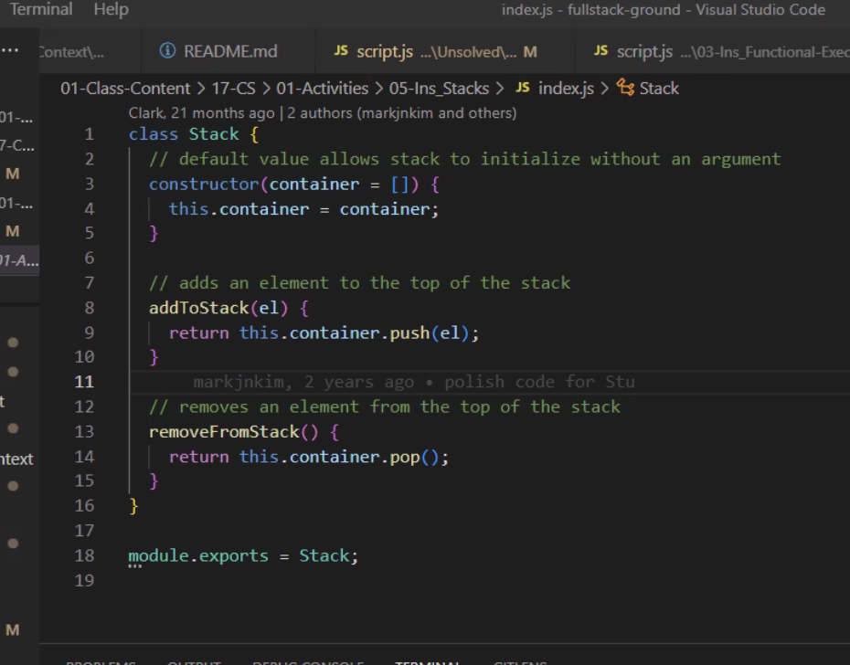
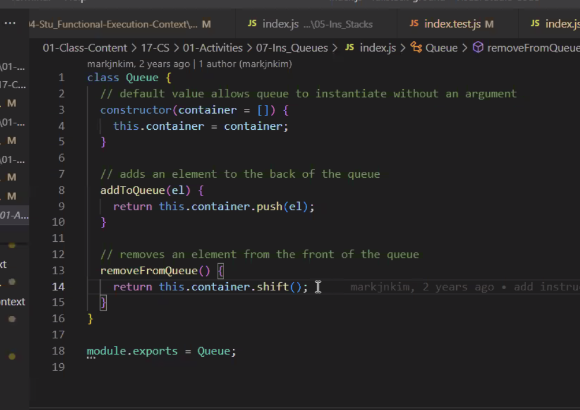
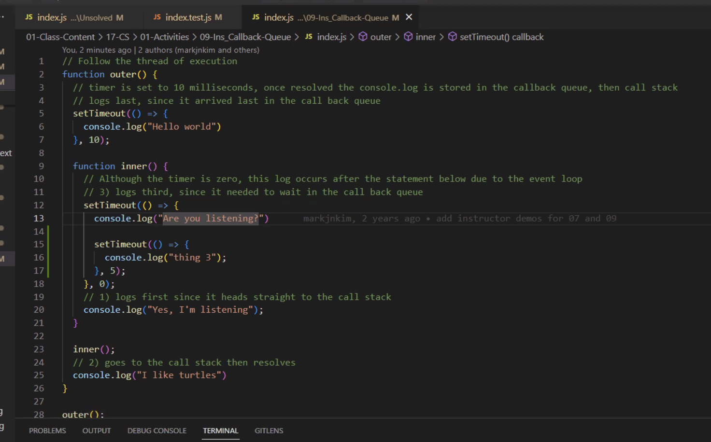

# Module 17: Computer Science for JavaScript
- [17.1: How Does JavaScript Execute?](#17.1-how-does-javascript-execute)
- [17.2: Functional Programming in JavaScript](#17.2-functional-programming-in-javascript)
- [17.3: Algorithms, Recursion, and the Technical Interview](#17.3-algorithms-recursion-and-the-technical-interview)

---

## 17.1: How Does JavaScript Execute?
- We’ve been learning practical stuff.
- Now we’ll learn more conceptual stuff.
- This will mean we can write better code.
- Understanding Computer Science will help us be better developers.
- Also, these concepts will help with interviews!
- Computational thinking.
- Two main concepts: Algorithms and Data Structures.
- Big O?
- Simple search => 0(n). It has to do with efficiency.
- Data Structures: arrays and dictionaries (objects).
- Arrays are more efficient.

---

### Global Execution Context
- Follow the thread of execution.
- JS only does one thing at a time, but it can jump around.
- Global execution is like a variable.
- A function is defined/declared, but the code isn’t run until the function is called.
- Sometimes code pauses, for example, to alert the user in the browser (standard alert, not something custom).
- Know the difference between global and functional execution context.

---

### Functional Execution Context
- Now we’re going to talk about `this`!
- This is confusing.
- If `this` is global, it’s the window.
- There’s also a `that`!
- It’s different with objects and arrow functions.

```
const globalThis = this
function myFuncA() {
	...
}

myFuncA()

const objB = {
	myFuncB: () => {
			console.lgo(`globalThis`, globalThis)
			console.log(`myFuncBThis`, this)
			console.log("myFuncB: ", globalThis === this)
	}
}

objB.myFuncB()

```

- For the activity, I could also keep `total` inside a function, `return total`, call the function, but make that equal a new variable.

```
function sum() {
	let total = 0
	// do something with total
	return total
}

const newTotal = sum()
```

- The above is better than moving total out of function, for some reason. I guess it’s better to keep total within scope of when it’s used.

---

### Stacks
- LIFO = Last in, first out.
- Think about stacking plates!
- There’s a function stack!
- In JS, an array can be a list, stack, or queue.

```
class Stack {

constructor (container = []) {
	this.container = container
}

addToStack(item) {
	return this.container.push(item)
}

removeFromStack() {
	return this.container.pop()
}

module.exports = Stack
```



---

### Queues
- FIFO: First in, first out.
- Works like a line to get coffee. First person in line is the first to get coffee.
- Stack examples were like push() and pop(). Does something to the end of the array.
- push() and shift().
- pop() takes something from the end.
- shift() takes something from the start. Shifts the queue (takes the first person from the line).
- Stacks and queues are arrays.
- In short, for stacks, use `push()` and `pop()`, and for queues use `push()` and `shift()`.
- In other words, the `push()` is always the same, but it differs when you try to remove something from a stack (LIFO) or a queue (FIFO).
- I’m not quite sure what the point of these concepts are, just yet.

```
class Queue {

constructor (container = []) {
	this.container = container
}

addToQueue(item) {
	return this.container.push(item)
}

removeFromQueue() {
	return this.container.shift()
}

module.exports = Queue;
```



---

### Callback Queue
- What is the thread of execution?
- As soon as you set a timeout, it calls a queue.
- Priority queue? Normal queue, but then there’s another queue?
- `setTimeout()` of 0 means first (first priority, but after all the other code is run). Code runs, then stuff with `setTimeout()`, in their order.
- This is used a lot in React.
- `setTimeout()` stores callbacks.
- `fetch()` goes in a queue?



---

## 17.2: Functional Programming in JavaScript
- 

---

## 17.3: Algorithms, Recursion, and the Technical Interview
- 

---